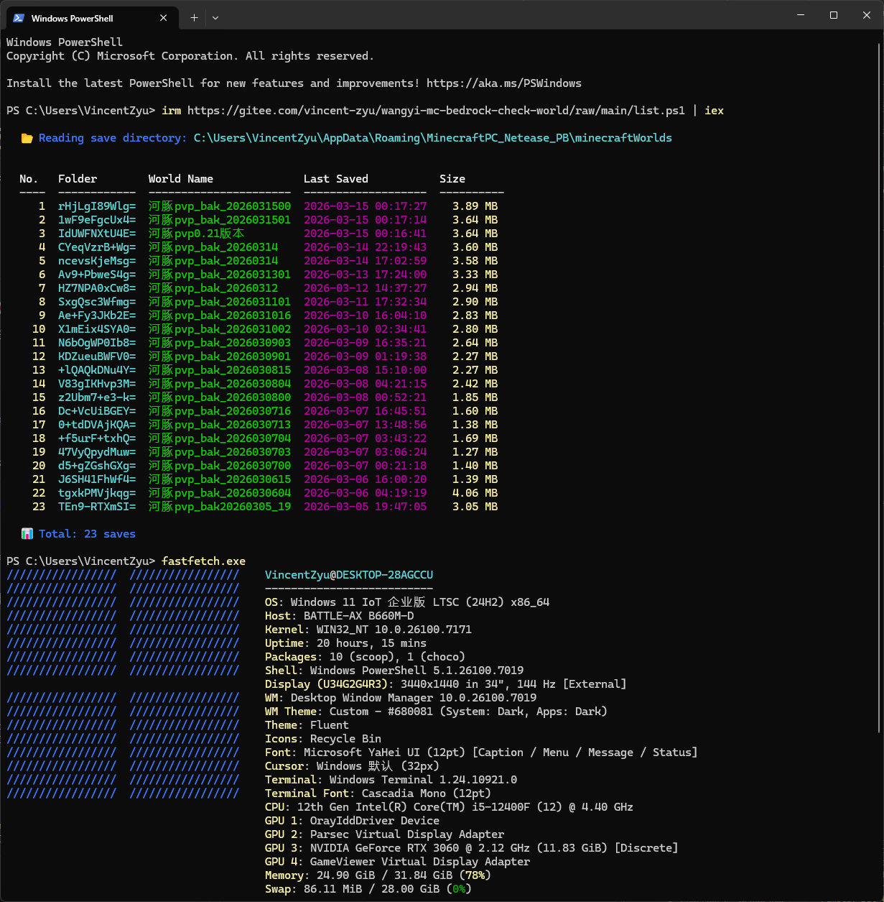

# Minecraft 网易版存档列表工具

[](https://gitee.com/vincent-zyu/wangyi-mc-bedrock-check-world)
[](https://github.com/VincentZyu233/wangyi-mc-bedrock-check-world)

由于脚本中使用了绝对路径（通过 `%APPDATA%` 获取），你可以将此脚本放在任何地方执行，它都能正确找到并运行捏。

## 效果预览



---


## 运行方式 (PowerShell)

### 方式 1：直接通过网络运行 (无需下载)
你可以直接远程读取并执行脚本，无需手动下载文件：

#### 使用 Python (推荐)
```powershell
# 从 GitHub 运行
irm https://raw.githubusercontent.com/VincentZyu233/wangyi-mc-bedrock-check-world/main/list.py | python

# 从 Gitee 运行 (如果 GitHub 访问慢)
irm https://gitee.com/vincent-zyu/wangyi-mc-bedrock-check-world/raw/main/list.py | python
```

#### 使用 PowerShell (如果你没有安装 Python)
```powershell
# 从 GitHub 运行
irm https://raw.githubusercontent.com/VincentZyu233/wangyi-mc-bedrock-check-world/main/list.ps1 | iex

# 从 Gitee 运行
irm https://gitee.com/vincent-zyu/wangyi-mc-bedrock-check-world/raw/main/list.ps1 | iex
```

### 方式 2：Git Clone 运行
如果你想保留一份在本地：

```powershell
# 从 GitHub 克隆
git clone https://github.com/VincentZyu233/wangyi-mc-bedrock-check-world.git
cd wangyi-mc-bedrock-check-world
# 运行 py 或 ps1
python .\list.py
.\list.ps1

# 从 Gitee 克隆
git clone https://gitee.com/vincent-zyu/wangyi-mc-bedrock-check-world.git
cd wangyi-mc-bedrock-check-world
# 运行 py 或 ps1
python .\list.py
.\list.ps1
```

## 功能
- 列出存档文件夹名
- 读取世界名称（`levelname.txt`）
- 显示最后保存时间（`level.dat` 修改时间）
- 计算并显示每个存档文件夹的总大小
- 自动处理中英文字符对齐问题
